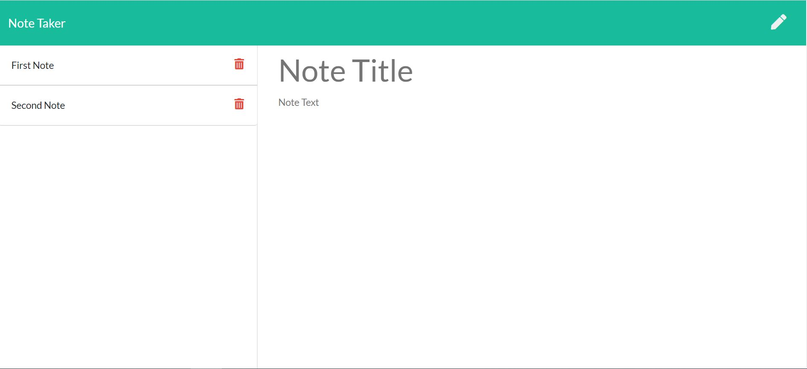

# Note Taker

## Description
This application can be used to write, save, and delete notes. It uses an express backend and saves and retrieves note data from a JSON file.
## Table of Contents
* [Installation](#installation)
* [Usage](#usage)
* [License](#license)
* [Contributing](#contributing)
* [Tests](#tests)
* [Questions](#questions)
## Installation
Please download/clone repository, install node.js and run npm install command from command line.
## Usage
It can be used to write, save and delete notes.
## Contributing
You are most welcome to contribute. There are following ways to contribute:
1. Please raise a pull request.
2. Please raise a defect.
3. Please raise a new feature request.
## Tests
If you want to test locally then first download repository, start express server by running "node server.js" command and then open web browser and access application at following URL : http://localhost:3000/.
Otherwise, you may test it using the appliation URL as provided below.
## Application URL
https://take-your-notes.herokuapp.com/
## Screenshot

## License
This application is covered by [Unlicense](./LICENSE) license
## Questions
* Please raise a request at [github](https://github.com/nitinmuk)
* For any private question/enquiry, please reach out to my email: nitinmukes@gmail.com

